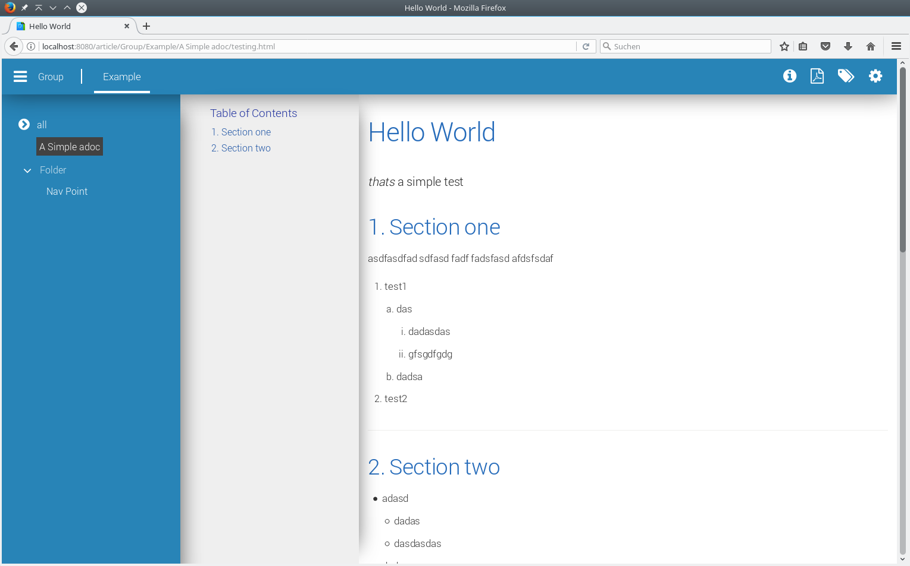

:navigation: asciidocgenerator/User Docs/Readme
:toc:

= asciidocgenerator

asciidocgenerator is a webapplication which can convert and publish asciidoc files in html and pdf. This application also provides integratoin for GitLab webhooks.

== Building

Just clone this repository, go into the asciidocgenerator-web folder and type "mvn package".
After the build has completed, you will find a *.war file and a *.jar file in the target folder.

== Running

The *.war file should be deployable on every Java EE 7 Web-Profile compliant app server (look into the link:https://github.com/konradrenner/asciidocgenerator/blob/master/asciidocgenerator-web/src/main/resources/project-defaults.yml[project-defaults.yml] file for required configurations of the server). Be aware that the link:https://github.com/asciidoctor/asciidoctorj[asciidoctorj] libs must be available in the system classloader of the appserver!

But we strongly recommend running the "fat jar" (asciidocgenerator-swar.jar), just with "java -jar" command. This will boot a WildFly Swarm instance with everything needed. If you start the app the first time, you have to create a realm in the provided Keycloak instance.

=== Initial Keycloak setup

Before the first start, just open "[URL]:[PORT]/auth" (e.g. localhost:8080/auth) in a browser. First you have to create a Keycloak admin user. After this, create a new realm like described here: https://dzone.com/articles/securing-wildfly-swarm-apps-with-keycloak

The Realm name and resource has to be "asciidocgenerator". If you use this convention, the existing keycloak.json must not be changed. Users which should be able to open the settings of the asciidocgenerator app must have the role "admin".

=== Properties

The following table displays properties which can be set at application start (if you want to overrule the defaults) via the -D argument:

[cols="3*", options="header"] 
|===
|Property
|Default
|Description

|asciidocgenerator.token
|none
|Token for authentication at a GitLab server

|asciidocgenerator.baseDirectory
|~/.asciidocgenerator/files
|Location of generated files
|===

=== WildFly Swarm configuration

If you use the "fat jar" you can use all properties of WildFly Swarm to configure it. Please visit the following sites for full details:

- link:https://reference.wildfly-swarm.io/configuration.html[Configuration of a WildFly Swarm Application]
- link:http://wildfly-swarm.io/tutorial/step-4/[Environment specific configuration]
- link:https://wildfly-swarm.gitbooks.io/wildfly-swarm-users-guide/content/v/2016.9/configuration/project_stages.html[Project Stages]
- link:https://github.com/wildfly-swarm/wildfly-swarm-examples[WildFly Swarm Examples]

== Using

The only thing you need to define in your asciidoc files, so that they will be converted and published, is the :navigation: header field. The value after the :navigation: field must be in the following form "groupname/mainnavigation/sidenavigation".

*Example:* _:navigation: Group/Example/Simple adoc_

*Example if you want a folder in the sidenavigation:* _:navigation: Group/Example/Folder/Nav Point_

If you want to attach one or more tags to an article, just include the :keywords: header field. The following example attaches two tags to the file ("work" and "very important").

*Example:* _:keywords: work, very important_

asciidocgenerator also comes with the asciidoctorj-diagram plugin, so it is possible to embed diagrams in your asciidoc files (e.g. plantuml) and the app will render it. Be aware that it is possible, that you need graphviz installed on the system, if you want asciidocgenerator to render diagrams (plantuml for examples supports generation via jdot, so that there is no graphviz necessary => have a look at link:https://github.com/konradrenner/asciidocgenerator/blob/master/asciidoc-examples/diagram_test.adoc[this file] to see how to turn on plantuml generation via jdot).

=== The user interface

The user interface consists of the main navigation, the side navigation and the asciidoc content. The left part of the main navigation displays the "group", right from the seperator there is the navigation part and the right part of the main navigation are action buttons (article details, generate pdf, tags, settings). Every entry, except the action buttons, is configured via the :navigation: header field of the asciidoc-document.

=== GitLab integration

The asciidocgenerator webapp provides integration for GitLab webhooks. You just have to provide the asciidocgenerator.token-Property and configure a webhook for the "Tag Push Hook". The webhook must be configured to send a POST Request to the following URL: _http://[URL]:[PORT]/api/v1/generator/gitlabtagpushed_

=== Generating local files

It is also possible to generate html and pdf files from adoc files which are stored on the local file system. Just have a look at the _"localfolder_generation_template.json"_ and _"post_localfoldercontent"_ files to get an idea how to convert and publish local files. On Linux/Unix systems you can use the "post_localfoldercontent"-script out of the box, just type _"./post_localfoldercontent --help"_ to see how it works (if you don't specify any options, the asciidoc-examples folder of this repository wil be tried to upload to a local running asciidocgenerator instance).
